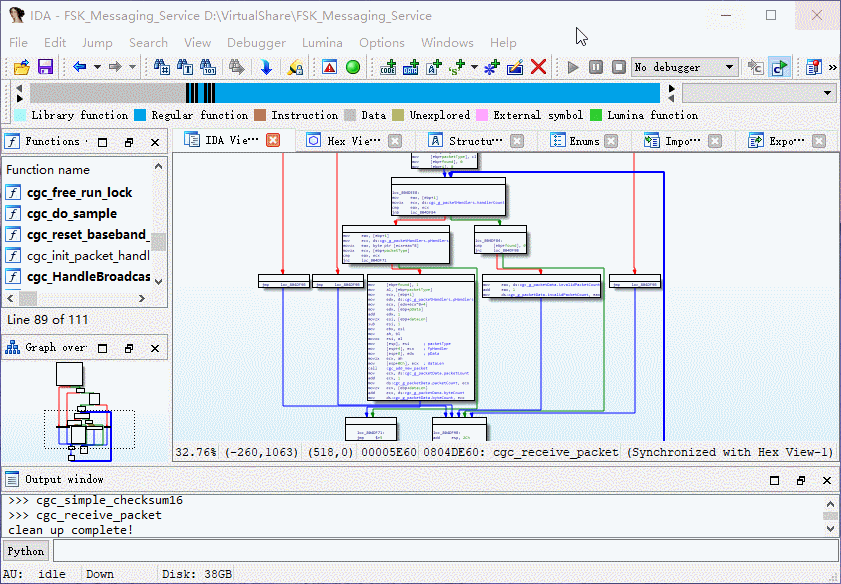

**Unitracer**



## Basic Usage

1.Hook basic block in unicorn script

```python
def unicorn_debug_block(uc, address, size, user_data):
    # Our tool uses "addr =" to track the data flow
    print("Basic Block: addr=0x{0:016x}, size=0x{1:016x}".format(address, size))
    
uc.hook_add(UC_HOOK_BLOCK, unicorn_debug_block)
```

2.Export instruction simulation record

```shell
python3 task_fibonacci.py > trace.txt 
```

3.Load the plug-in and open `address-record`

output: call stack

```shell
>>> ----- start tracking function ----- >>>
>>> cgc_do_sample
>>> cgc_receive_packet
>>> cgc_simple_checksum16
>>> cgc_receive_packet
```

output: set color (basic block)

4.Use the shortcut `Ctrl + H` to clear the color setting of the basic block


