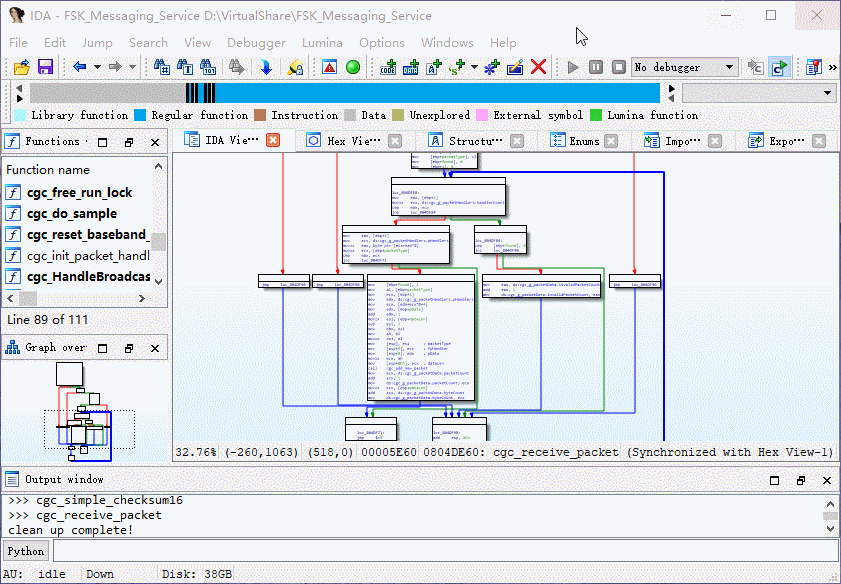

## 基本用法

1.Unicorn 脚本中，hook 每个基本块

Python

```python
def uc_debug_block(uc, address, size, user_data):
    # Our tool uses "addr =" to track the data flow
    print("Basic Block: addr=0x{0:016x}, size=0x{1:016x}".format(address, size))
    
uc.hook_add(UC_HOOK_BLOCK, uc_debug_block)
```

C
```c
void uc_debug_block(uc_engine *uc, int addr, int size, void *user_data) {
    print("Basic Block: addr=0x%x, size=0x%x", addr, size);
}

hook_add(uc, &hook2, UC_HOOK_BLOCK, uc_debug_block, NULL, 1, 0);
```

2.运行 Unicorn 脚本，导出数据流

```shell
python3 task_fibonacci.py > trace.txt 
```

3.IDA 加载插件，并打开 Unicorn 数据流文件

4.清除着色：使用快捷键`'Ctrl+H'`


